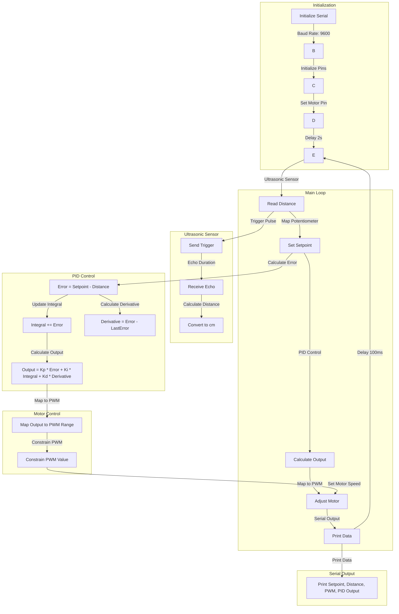

# Readme for PID-controlled Ultrasonic Distance Measurement with Motor Control

## Table of Contents

1. [Introduction](#introduction)
2. [Setup](#setup)
3. [Dependencies](#dependencies)
4. [Configuration](#configuration)
5. [Operation](#operation)
6. [PID Parameters](#pid-parameters)
7. [Sensor Calibration](#sensor-calibration)
8. [Motor Control](#motor-control)
9. [Serial Output](#serial-output)
10. [Troubleshooting](#troubleshooting)
11. [Flowchart](#11-flowchart)
12. [Contributing](#contributing)
13. [License](#license)

---

## 1. Introduction

This repository contains code for a PID-controlled system that combines an ultrasonic sensor for distance measurement and motor control based on a setpoint. The PID algorithm helps maintain a specified distance from an obstacle by adjusting the motor speed.

## 2. Setup

Ensure the following connections:

- Trig pin of the ultrasonic sensor connected to pin 3.
- Echo pin of the ultrasonic sensor connected to pin 2.
- Potentiometer connected to analog pin A0.
- Motor control pin connected to pin 9.

## 3. Dependencies

This code requires the Arduino IDE and the accompanying Arduino library for ultrasonic sensors. Ensure you have these installed before uploading the code.

## 4. Configuration

Adjust the PID parameters (Kp, Ki, Kd) and setpoint range in the code based on your specific requirements. Also, configure the motor control pin and potentiometer pin according to your hardware setup.

## 5. Operation

Upon setup, the system uses the ultrasonic sensor to measure distance and adjusts the motor speed to maintain the setpoint distance. The potentiometer allows you to set the desired distance range.

## 6. PID Parameters

Fine-tune the proportional (Kp), integral (Ki), and derivative (Kd) gains to optimize the system's performance. Experimentation may be required for your specific use case.

## 7. Sensor Calibration

Calibrate the setpoint range using the potentiometer. Map the analog readings to the desired distance range for accurate distance control.

## 8. Motor Control

The motor control is implemented using PWM. Adjust the PWM range in the code to match the motor specifications and achieve the desired speed control.

## 9. Serial Output

The serial output provides real-time information about the setpoint, measured distance, PWM value, and PID output. Use this information for debugging and monitoring the system.

## 10. Troubleshooting

Refer to the troubleshooting section in case of issues. Common problems and solutions are outlined to help you resolve any operational issues.

## 11. Flowchart

## 12. Contributing

Contributions are welcome! Feel free to submit issues, propose enhancements, or fork the repository for your own experiments.

## 13. License

This code is distributed under the [MIT License](LICENSE). Feel free to use and modify it for your projects.
