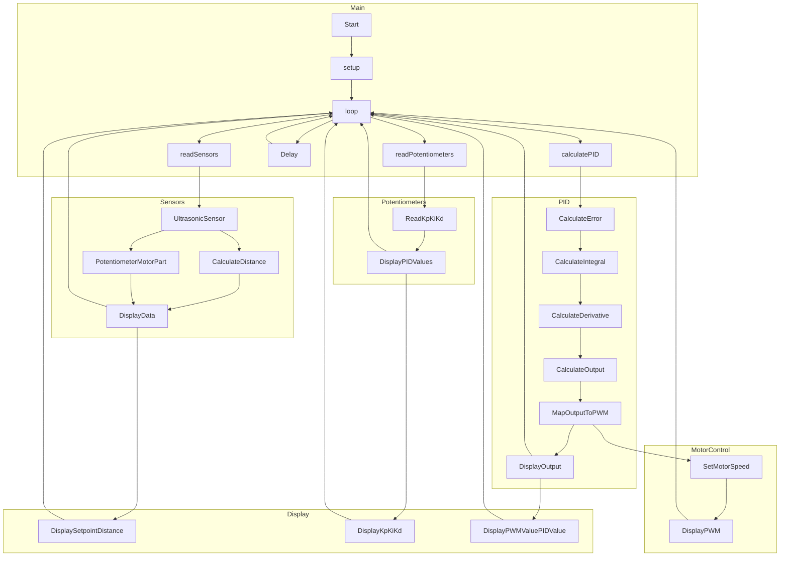

# Arduino PID Control System with adjustable Kp, Ki, and Kd settings

## Table of Contents

1. [Introduction](#introduction)
2. [System Overview](#system-overview)
3. [Setup](#setup)
4. [Components](#components)
   - [Ultrasonic Sensor](#ultrasonic-sensor)
   - [Potentiometer and Motor](#potentiometer-and-motor)
   - [Potentiometers for PID Tuning](#potentiometers-for-pid-tuning)
   - [PID Calculation](#pid-calculation)
5. [Usage](#usage)
   - [Monitoring System Output](#monitoring-system-output)
   - [Interpreting Serial Output](#interpreting-serial-output)
6. [Adjusting PID Parameters](#adjusting-pid-parameters)
   - [Proportional Gain (Kp)](#proportional-gain-kp)
   - [Integral Gain (Ki)](#integral-gain-ki)
   - [Derivative Gain (Kd)](#derivative-gain-kd)
7. [Flowchart](#flowchart)
8. [Contributing](#contributing)
9. [License](#license)

## Introduction

Welcome to the PID Control System repository! This project involves an Arduino implementation of a PID (Proportional-Integral-Derivative) control system. The system utilizes an ultrasonic sensor to measure distance and dynamically adjusts a motor's speed to maintain a user-defined setpoint distance.

## System Overview

The core functionality of the PID control system lies in its ability to continuously measure distance using an ultrasonic sensor and apply PID control principles to adjust a motor's speed. The system aims to maintain a consistent distance setpoint through real-time adjustments based on feedback from the ultrasonic sensor.

## Setup

1. **Hardware Connection:**
   - Connect the ultrasonic sensor, potentiometer, and motor to the specified pins on the Arduino board as outlined in the code.
2. **Code Upload:**
   - Upload the provided Arduino code to the board using the Arduino IDE or any compatible development environment.
3. **Power On:**
   - Power on the system, and it will begin operating the PID control loop.

## Components

### Ultrasonic Sensor

The ultrasonic sensor is a key component responsible for measuring distances. It achieves this by emitting ultrasonic waves and calculating the time it takes for the waves to bounce back. The duration is then used to compute the distance in centimeters.

### Potentiometer and Motor

- **Potentiometer (Setpoint Adjustment):**
  - The potentiometer allows users to set the desired distance setpoint. It converts the analog input into a range suitable for the setpoint.
- **Motor Control:**
  - The motor's speed is dynamically adjusted based on PID calculations to ensure the measured distance aligns with the user-defined setpoint.

### Potentiometers for PID Tuning

Three potentiometers (KpPotPin, KiPotPin, KdPotPin) serve the purpose of fine-tuning the PID parameters (Kp, Ki, Kd) for optimal system performance. These parameters play a crucial role in governing the system's responsiveness, stability, and overall efficiency.

### PID Calculation

The PID algorithm is the heart of the control system, responsible for maintaining the setpoint distance. The algorithm involves the following steps:

- **Error Calculation:**
  - The error is computed as the difference between the setpoint and the actual measured distance.
- **Integral and Derivative Terms:**
  - The integral term accumulates the historical error, and the derivative term represents the rate of change of the error.
- **Output Calculation:**
  - The PID output is determined as a combination of the proportional, integral, and derivative terms.
- **Motor Control Signal:**
  - The PID output is mapped to a PWM (Pulse Width Modulation) range, which controls the motor's speed.

## Usage

The system operates continuously, adjusting the motor's speed to maintain the desired setpoint. Users can monitor the system output through the Arduino Serial Monitor.

### Monitoring System Output

To observe the system's behavior, follow these steps:

1. Open the Arduino IDE.
2. Navigate to `Tools -> Serial Monitor` or press `Ctrl + Shift + M`.
3. The Serial Monitor will display real-time information about setpoint, measured distance, PID parameters, PWM values, and PID control output.

### Interpreting Serial Output

The serial output provides valuable insights into the system's operation. Key information includes:

- **Setpoint and Distance:**
  - Displays the user-defined setpoint and the measured distance in centimeters.
- **PID Parameters:**
  - Shows the current values of the proportional (Kp), integral (Ki), and derivative (Kd) gains.
- **PWM Value and PID Output:**
  - Presents the PWM value sent to the motor and the resulting PID control output.

## Adjusting PID Parameters

Fine-tuning PID parameters is essential for optimizing system performance. The potentiometers for Kp, Ki, and Kd allow users to make real-time adjustments.

### Proportional Gain (Kp)

- The Kp potentiometer influences the system's responsiveness to deviations from the setpoint. Increase Kp for a more responsive system but avoid overshooting.

### Integral Gain (Ki)

- The Ki potentiometer impacts the system's ability to eliminate steady-state errors over time. Adjust Ki to address long-term deviations.

### Derivative Gain (Kd)

- The Kd potentiometer controls the system's response to sudden changes. Proper adjustment helps in minimizing overshooting and oscillations.

## Flowchart

## Contributing

Contributions are welcomed! If you have ideas for improvements or find issues, please feel free to submit them through issues or pull requests.

## License

This project is licensed under the [MIT License](../../LICENSE).
